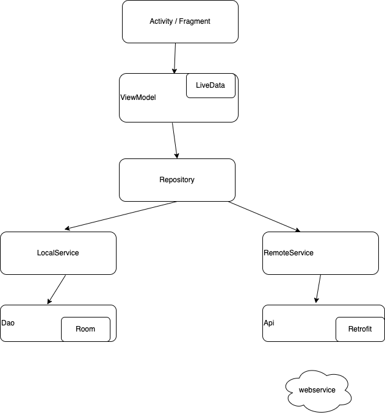
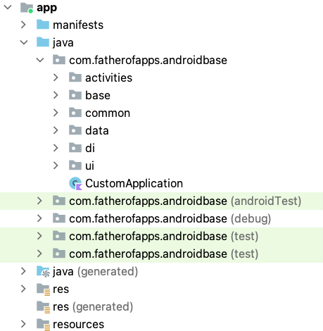

# 7weather

An applications allows the user search for weather information.
1. Architecture

2. Code folder structure

3. Sequence diagram

3. Key libraries are used in this project:
   Retrofit, Room, Moshi, Hilt, Kotlin-Coroutines, ThreetenBP, Mockito, Truth

4. Checklist of items:
   <ul>
   <li>Programming language: Kotlin</li>
   <li>Design app's architecture: MVVM</li>
   <li>Apply LiveData mechanism: Yes</li>
   <li>UI should be looks like in attachment: Yes. I want to add a search history feature,but I do not have enough time to do it.</li>
   <li>Write Unit Tests: Yes</li>
   <li>Exception handling: Yes</li>
   <li>Caching handling: Yes.</li> 

 </ul>
   
